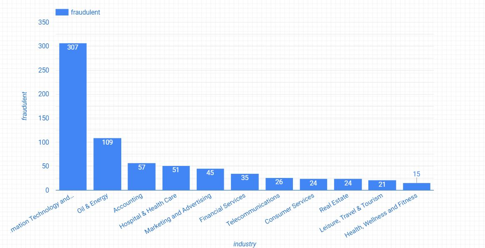
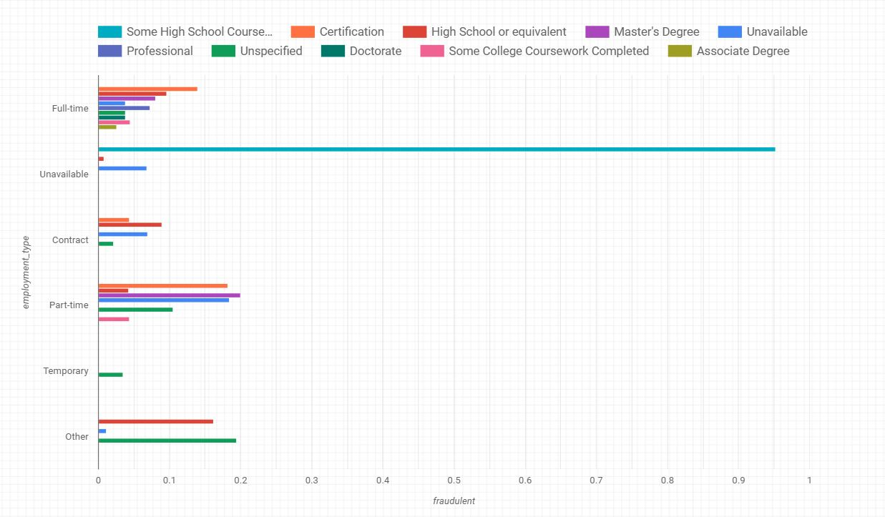
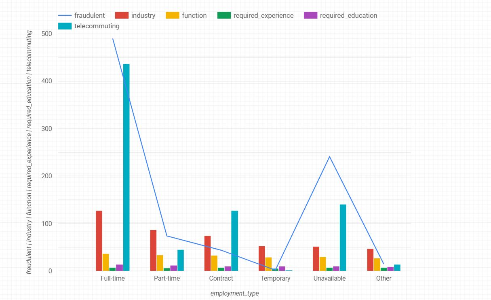

<h1 align = "center"> Fake Job Posting Prediction </h1>

 

 

## Team Name: Data Diggers

Team Members:
1. Uma Sai Madhuri Jetty
2. Sahithi Priya Gutta
3. Ankita Kumari
4. Ashesh Shahi

 

## Project Description 
- The job market is hard enough to navigate without having to worry about some posting turning out to be a scam—or even just a dead end.
- The project focuses on predicting which job descriptions are fraudulent or real using text data and meta data features.
- Focuses on identifying key traits/features of job descriptions which are fraudulent in nature.
- The main audience of this project will be the students and job- seekers looking for any job opportunities such as: internships, part-   time, full-time jobs.

### 1. Reasearch Question
Job boards can be host to scammers who are looking to defraud victims who are at their most suggestible and vulnerable 
that is, job seekers who are so eager to land a position that they ignore the warning signs that all is not as it seems.
Scammers know that finding a job can be tough. To trick people looking for honest work, scammers advertise where real employers 
and job placement firms do. They also make upbeat promises about your chances of employment, and virtually all of them 
ask you to pay them for their services before you get a job. 
  The major targets for the scammers are students. Colleges/Universities always explains the students the red flags regarding the 
employment oppurtunities. Still it is not hundered percent possible to eliminate all the scams or save students from scams all the time.
Therefore, we propose a solution to which helps to identify the fradulent jobs using text and meta data information modelling.  

### 2. Domain and Data: Data Description

#### A. Source and Size of Data
The Dataset has data from fake_job_posting.csv downloaded from Kaggle. It's a dataset of 48 MB, owned by Shivam Bansal. There are total 18 columns in the data file.
- job_id - Unique Job ID
- title - The title of the job ad entry.
- location - Geographical location of the job ad.
- department - Corporate department (e.g. sales).
- salary_range - Indicative salary range (e.g. $50,000-$60,000)
- company_profile - A brief company description.
- description - The details description of the job ad.
- requirements - Enlisted requirements for the job opening.
- benefits - Enlisted offered benefits by the employer.
- telecommuting - True for telecommuting positions.
- has_company_logo - True if company logo is present.
- has_questions - True if screening questions are present.
- employment_type - Full-type, Part-time, Contract, etc.
- required_experience - Executive, Entry level, Intern, etc.
- required_education - Doctorate, Master’s Degree, Bachelor, etc.
- industry - Automotive, IT, Health care, Real estate, etc.
- function - Consulting, Engineering, Research, Sales etc.
- fraudulent - target variable - Classification attribute.

#### B. Explratory Data Analysis
- Examine important interrelationships between attributes
- Identify interesting subsets of the observations
- Develop an initial idea of possible associations amongst the predictors, as well as between the predictors and the target variable.

#### C. Preprocessing Phase
- In this phase, First we try to find out which columns has null values in the dataset.
- Then we  fill the missing values of the columns in the dataset.
- We also look for outliers and try to remove them.
- After that we check the correlation between the features (columns) to find out the most relevant features for the prediction.
- Download the fake_job_postings.ipynb Notebook to have a clear idea on the preprocessing done.

### 3. Dashboard for Users and Dashboard for Data Engineers
- We'll create two different dashboards one for our main audience/users i.e students or job-seekers and the other for Data Engineers.
- Dashboard for users will be more simplified and more action oriented for filters or parameters so that users would be able to           use it easily.
### User Dash boards: 
- Created User Dashboard using Big Query and Google Data Studio.
- Uploaded the pre-processed data on GCP cloud storage through big query.
- Visualized the data and created diffrent charts using Data studio that are shown below.
- https://cloud.google.com/bigquery/docs/quickstarts/quickstart-web-ui link for the BigQuery web UI in the Cloud Console and step by step explanation of loading and cleaning the dataset.

#### 3.1. Bar chart of Fraudulent count  in various Industries

  

#### 3.2. Bar Chart representing Employment_type w.r.t Fraudulent based on Required Education 

  

#### 3.3. Line Chart representing fraudulent cases w.r.t employment type based on multiple variables 

  

##### Please download fake_job_postings.ipynb jupyter notebook and Fake_Job_Postings_Report.pdf to access a more sophisticated dashboard on the dataset.

### 4. Tentative plan for analysis on GCP

##### GCP processing - ML
- After cleaning the data and placing it in proper storage, we will start training dataset to run on AI platform.
- Since most of the features are categorical, we will be using classification models for the prediction.
- We will use differet models such as logistic regression and Natural Language Processing to predict the the fake job posings.

##### Evaluation of Results
- After training and building the models we will use AutoML Natural Language which provide and aggregate set of evaluation metrics how     well the model performs overall.
- We will use precision and recall to measure how well the model is capturing information, and how much it's leaving out.
- We will use confusion matrix that represents the percentage of times each label will be predicted in the training set during             evaluation
- We will also use Mean Absolute error and mean squared error to measure the distance between the predicted sentiment value and the       actual sentiment value.

##### Steps for production Model
- To train and build the model we will use AutoML Natural Language UI.
- After training, we will export the models for deployment on AI Platform Prediction.
- Then deploy the models and get predictions.
- Finally, we will evaluate the models.

##### Final Dashboard for User Group
- Final Dashboard will contain various charts identifying Fake job postings based on different factors such as: Company Profile,           Job-description, Benefits, Requirements, and Locations. 

### 5. Research Citations
1. Iup.edu. 2020. Scams - Student Employment - IUP.[online] 
Available at: <https://www.iup.edu/studentemployment/off-campus/scams/> [Accessed 5 April 2020]. 

2.  Doyle, A., 2019. List Of Fake Job Scam Examples. [online] 
The Balance Careers.  
Available at: <https://www.thebalancecareers.com/list-of-fake-job-scam-examples-2062168> [Accessed 5 April 2020]. 

3. Sangdi Lin, Bahareh Azarnoush, George C. Runger, Article Feb 2018 - Data Preparation. [online]  
Research Gate.  
Available at: https://www.researchgate.net/publication/316113863_Data_Preparation [Accessed 6 April 2020].  

  
Abstract:- Recently the crucial recruiting process has been porting to the cloud. In particular, the automated systems that are responsible for completing the online recruiting of new hires seek to make the hiring process more rapid, efficient and cost-effective.
However, the online disclosure of these conventional business practices has created new points of failure which can lead to loss of applicants 'privacy and damage organizations' credibility. The most popular case of Online Recruitment Frauds (ORF), so far, is work scam.Unlike relevant online fraud problems, the tackling of ORF has not yet received the proper attention, remaining largely unexplored until now. 
Job's that sound too good to be true should raise a red flag for any college student.Fake job postings are being sent via unsolicited emails to student accounts and are even showing up in online job listing sites. Titles like "work from home" or "part-time job offer" are being sent to students.The scammer uses the job posting to get work seekers to provide personal information, including their Social Security number, credit card details and bank account details.The details is then used to access your credit card or bank account and to steal your identity.
  

